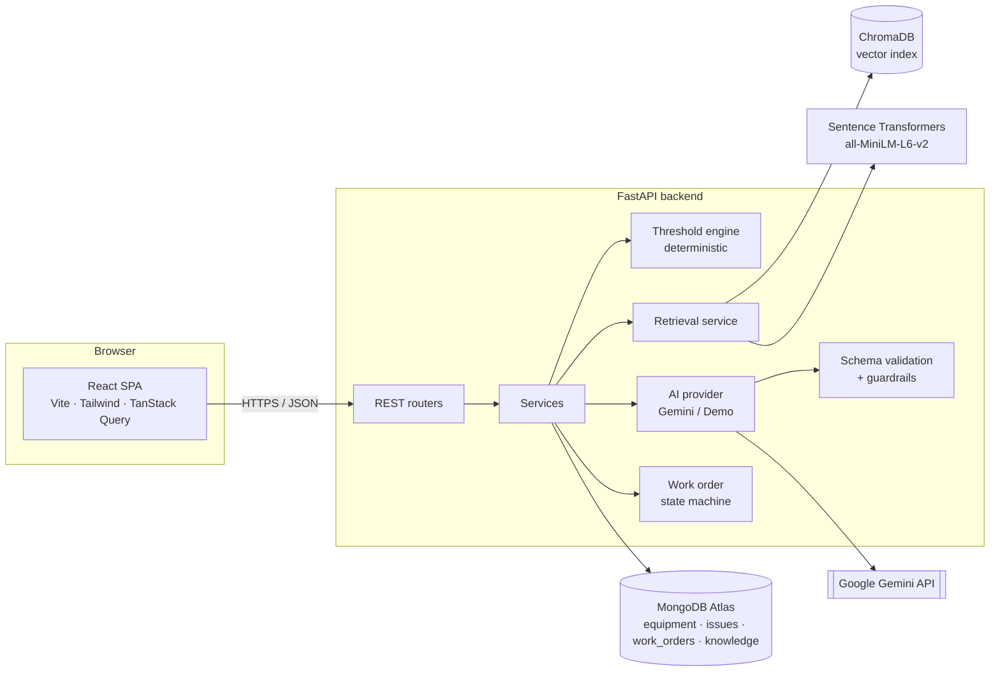
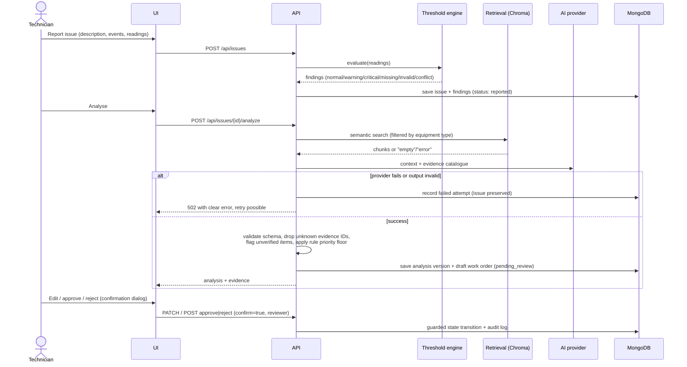

# MaintainIQ

**Intelligent Maintenance. Reliable Operations.**

MaintainIQ is an AI-assisted triage assistant for industrial equipment maintenance. A technician reports a problem with a pump, HVAC unit or conveyor motor. MaintainIQ then:

1. runs **deterministic threshold rules** on the sensor readings (no AI involved),
2. retrieves **relevant manual excerpts** with semantic search (Sentence Transformers + ChromaDB),
3. asks **Gemini** (or a clearly labelled demo provider) for a structured triage draft,
4. validates that draft against a strict schema and **guardrails** (evidence must exist, priority cannot be lower than the rules imply),
5. creates a **draft work order** that a technician must edit, approve or reject.

The AI never approves work orders and never controls equipment.

---

## Contents

- [Features](#features)
- [Architecture](#architecture)
- [Technology stack](#technology-stack)
- [Folder structure](#folder-structure)
- [Getting started](#getting-started)
- [Configuration](#configuration)
- [Seed data and demo mode](#seed-data-and-demo-mode)
- [Testing](#testing)
- [API reference](#api-reference)
- [Deployment](#deployment)
- [Limitations](#limitations)
- [Safety boundaries](#safety-boundaries)

---

## Features

| Area | What it does |
|---|---|
| **Dashboard** | KPIs (total equipment, open issues, high-priority issues, pending work orders), 14-day activity chart, priority distribution, equipment status, recent issues and decisions. All values come from the database. |
| **Equipment** | Searchable, filterable list; add equipment; details page with issue history, work orders and a merged maintenance timeline. |
| **Issue reporting** | Validated form (client: React Hook Form + Zod; server: Pydantic). Dynamic operating events and optional sensor readings with units. Entries are kept if submission fails, and you can retry. The issue is saved *before* any AI runs. |
| **Threshold engine** | Configurable per-equipment-type rules. Handles missing readings (never treated as zero), invalid and implausible values, unit conversion (°F/K, psi/kPa, in/s), stale and future-dated timestamps, and conflicting readings. |
| **Knowledge base / RAG** | PDF/TXT upload → extraction → cleaning → page-aware chunking → embeddings → ChromaDB. Shows ingestion status, chunk viewer, a retrieval test console, re-index and delete. |
| **AI triage** | Provider abstraction: live Gemini or a deterministic demo provider (always labelled *Simulated*). Output is checked against a Pydantic schema; Gemini gets one repair attempt. Failures are recorded and the issue is preserved. |
| **Evidence** | Four evidence types (`MANUAL`, `OPERATING_EVENT`, `SENSOR_RULE`, `USER_REPORT`). Every citation resolves to a real chunk or a real record. Recommendations without valid evidence are labelled *Unverified hypothesis*. |
| **Human-in-the-loop** | Edit title, description, priority, checklist and notes; approve or reject only through a confirmation dialog. Server-side state machine, original AI draft kept unchanged, approved version snapshot, full audit log. |
| **History** | Issue history filterable by equipment, priority, status, date range and text. Every analysis attempt (including failures) is versioned. |
| **Observability** | Structured JSON logs with request ID, endpoint, duration, issue/work-order IDs, AI provider status, retrieval status and decisions. The `X-Request-ID` header is returned on every response and included in error bodies. |

The analysis page labels every statement by where it came from: **Observed**, **Rule-based finding**, **AI hypothesis** or **Technician-confirmed**.

---

## Architecture



### AI triage workflow



### Key design decisions

- **Rules before AI.** Threshold findings are computed when the issue is created and stored as facts. The model receives them as read-only context and cannot change them. If the AI suggests a lower priority than the rules imply (critical finding → at least *high*, warning → at least *medium*), the backend raises it and records why.
- **Evidence integrity is enforced in code, not only in the prompt.** After validation, any evidence ID that is not in the catalogue is removed and logged. A cause or step left with no evidence is marked `unverified: true`.
- **No silent fallback.** If Gemini is configured and fails, the backend does not switch to the demo provider. The failure is stored in `analysis_history` and the UI shows it.
- **Race-safe decisions.** Approve and reject use `find_one_and_update` filtered on the current status, so two concurrent decisions cannot both succeed. Approved and rejected are terminal states.
- **Rebuildable vector index.** Extracted document text is stored in MongoDB, so ChromaDB can be rebuilt on hosts with ephemeral disks (`REINDEX_ON_STARTUP`).

---

## Technology stack

| Layer | Technologies |
|---|---|
| Frontend | React 19 (JavaScript/JSX), Vite 8, Tailwind CSS 4, shadcn-style components (Radix Dialog, CVA, tailwind-merge), Lucide React, React Router 7, Axios, TanStack Query 5, React Hook Form, Zod 4, Recharts 3 |
| Backend | Python, FastAPI, Pydantic v2, pydantic-settings, PyMongo, Uvicorn, Python logging (JSON) |
| AI / RAG | Google Gemini via `google-genai`, Sentence Transformers (`all-MiniLM-L6-v2`), ChromaDB, pypdf |
| Database | MongoDB Atlas (verified against a live Atlas cluster and a local MongoDB 8.0.12) |
| Testing | Pytest (+ mongomock, FastAPI TestClient), Vitest, React Testing Library |
| Deployment | Vercel (frontend), Render (backend), MongoDB Atlas |

---

## Folder structure

```
maintainiq/
├── backend/
│   ├── app/
│   │   ├── main.py                 # FastAPI app, CORS, request-ID middleware, startup tasks
│   │   ├── seed.py                 # python -m app.seed [--reset]
│   │   ├── core/                   # config, database, logging, errors
│   │   ├── models/                 # collection names, status enums, state transitions, ID generation
│   │   ├── schemas/                # Pydantic request/response + AI output schemas
│   │   ├── api/                    # equipment, issues, work_orders, knowledge, health (+dashboard, thresholds)
│   │   ├── services/
│   │   │   ├── threshold_service.py   # deterministic rule engine
│   │   │   ├── retrieval_service.py   # embeddings + ChromaDB
│   │   │   ├── ai_service.py          # provider abstraction, Gemini, validation, guardrails
│   │   │   ├── demo_provider.py       # deterministic, labelled simulated provider
│   │   │   ├── prompts.py             # system/user prompts
│   │   │   ├── triage_service.py      # orchestration + evidence building
│   │   │   ├── work_order_service.py  # HITL state machine + audit log
│   │   │   └── equipment/issue/knowledge/dashboard services
│   │   ├── utils/                  # text extraction/chunking, serialization
│   │   └── tests/                  # pytest suite
│   ├── data/
│   │   ├── threshold_profiles.json # FICTIONAL demo thresholds
│   │   └── manuals/                # FICTIONAL sample manuals
│   ├── requirements.txt            # full (incl. torch CPU + sentence-transformers)
│   ├── requirements-lite.txt       # no ML model (hashing embeddings) for small hosts
│   ├── requirements-dev.txt
│   ├── render.yaml
│   └── .env.example
├── frontend/
│   ├── src/
│   │   ├── components/{ui,layout,dashboard,equipment,issues,workorders,common}/
│   │   ├── pages/                  # Dashboard, Equipment, EquipmentDetails, ReportIssue, IssueAnalysis,
│   │   │                           # WorkOrders, WorkOrderDetails, IssueHistory, KnowledgeBase, Settings
│   │   ├── layouts/DashboardLayout.jsx
│   │   ├── services/api.js         # Axios client + error normalisation
│   │   ├── hooks/useApi.js         # TanStack Query hooks
│   │   ├── context/ReviewerContext.jsx
│   │   ├── utils/  test/
│   ├── vercel.json
│   └── .env.example
├── README.md
├── AGENT_USAGE.md
└── .gitignore
```

---

## Getting started

### Prerequisites

- **Python 3.12+** (developed and tested on 3.14.6)
- **Node.js 20+** (developed on 20.19)
- **MongoDB**: either a MongoDB Atlas cluster or a local `mongod`
- Optional: a **Gemini API key** from Google AI Studio (without one, use demo mode)

### 1. Backend

```bash
cd backend
python -m venv .venv
# Windows: .venv\Scripts\activate    macOS/Linux: source .venv/bin/activate
pip install -r requirements-dev.txt        # includes CPU torch (~200 MB download)
cp .env.example .env                       # then edit MONGODB_URI etc.
python -m app.seed --reset                 # equipment, fictional manuals, sample scenarios
uvicorn app.main:app --reload --port 8000
```

- API docs: http://localhost:8000/docs (disabled when `APP_ENV=production`)
- Health check: http://localhost:8000/api/health

The first embedding call downloads `all-MiniLM-L6-v2` (~90 MB) from Hugging Face and caches it.

### 2. Frontend

```bash
cd frontend
npm install
cp .env.example .env          # VITE_API_URL=http://localhost:8000
npm run dev                   # http://localhost:5173
```

### MongoDB setup

- **Atlas:** create a free cluster, add a database user, allow your IP (or `0.0.0.0/0` for Render), and copy the `mongodb+srv://` connection string into `MONGODB_URI`.
- **Local:** run `mongod` and keep the default `MONGODB_URI=mongodb://localhost:27017`.
- Indexes are created automatically at startup (unique business IDs, plus status, priority and equipment/date indexes).
- If MongoDB is unreachable, `/api/health` reports `degraded` and every data endpoint returns **503 "Database is unavailable. The request was not saved."** The app never pretends to persist anything.

### Gemini setup

1. Create an API key in Google AI Studio.
2. In `backend/.env` set `AI_PROVIDER=gemini` and `GEMINI_API_KEY=...` (optionally `GEMINI_MODEL`).
3. Restart the API. `/api/health` shows `ai.provider = gemini, is_simulated = false`.

The key is only read by the backend. The frontend has no access to it.

### ChromaDB setup

There's nothing to install separately. ChromaDB runs embedded in the API process. Vectors are stored in `CHROMA_PERSIST_DIR` (default `backend/data/chroma`). If that directory is lost, the API rebuilds it from the document text stored in MongoDB at startup (`REINDEX_ON_STARTUP=true`).

---

## Configuration

### Backend (`backend/.env`)

| Variable | Default | Purpose |
|---|---|---|
| `APP_ENV` | `development` | `production` disables `/docs` |
| `DB_BACKEND` | `mongo` | `memory` = mongomock, **not persistent** (tests/throwaway demos; shown in a UI banner) |
| `MONGODB_URI` / `MONGODB_DB` | `mongodb://localhost:27017` / `maintainiq` | Database connection |
| `CORS_ORIGINS` | `http://localhost:5173,...` | Comma-separated allowed origins |
| `AI_PROVIDER` | `demo` | `gemini` or `demo` |
| `GEMINI_API_KEY` / `GEMINI_MODEL` | — / `gemini-2.5-flash` | Live AI |
| `EMBEDDING_PROVIDER` | `sentence-transformers` | `hashing` = lexical fallback for low-memory hosts |
| `CHROMA_MODE` / `CHROMA_PERSIST_DIR` | `persistent` / `./data/chroma` | Vector store |
| `RETRIEVAL_TOP_K` / `RETRIEVAL_MIN_SCORE` | `4` / `0.25` | Retrieval tuning |
| `STALE_READING_MINUTES` | `120` | Age after which a reading is flagged stale |
| `THRESHOLD_PROFILES_PATH` | `data/threshold_profiles.json` | Rule configuration |
| `SEED_ON_STARTUP` / `REINDEX_ON_STARTUP` | `false` / `true` | Startup tasks (run in a background thread) |

### Frontend (`frontend/.env`)

| Variable | Purpose |
|---|---|
| `VITE_API_URL` | Base URL of the API, e.g. `https://maintainiq-api.onrender.com` |

---

## Seed data and demo mode

`python -m app.seed --reset` creates:

- **Equipment:** `PUMP-001` Industrial Water Pump, `HVAC-002` Commercial HVAC Unit, `MOTOR-003` Conveyor Motor (plus `PUMP-004`, `MOTOR-005`).
- **Fictional manuals:** AquaFlow CP-200 pump, ClimaCore RT-50 HVAC, DriveMax CM-75 motor. These are clearly marked as fictional sample manuals.
- **Scenarios:**

| Scenario | Equipment | What it demonstrates |
|---|---|---|
| Critical threshold | PUMP-001 | 94 °C and 9.2 mm/s exceed critical thresholds → priority floor *high* |
| Warning threshold | HVAC-002 | 38 °C supply air exceeds the warning threshold |
| Normal readings | MOTOR-003 | All within range; includes an example approved work order |
| Missing + stale data | PUMP-004 | Only one 5-hour-old pressure reading; the other sensors are reported *missing* |

Seed analyses always use the demo provider, so seeding never spends API quota. They are labelled **Simulated (demo mode)**.

**Demo mode** (`AI_PROVIDER=demo`) lets reviewers run every workflow without an API key. The demo provider is deterministic and keyword-based. It follows the same contract as Gemini: hypotheses only, citations only to evidence that exists, confidence never "high". Every screen that shows its output displays a *Simulated* badge, and a banner explains that analyses are not generated by Gemini.

### Threshold disclaimer

The thresholds in `data/threshold_profiles.json` are **fictional demonstration values**. They are not certified, manufacturer-approved or standards-based operating limits. Example (pump): temperature warning > 75 °C, critical > 90 °C; pressure warning > 8 bar, critical > 10 bar; vibration warning > 5 mm/s, critical > 8 mm/s.

---

## Testing

```bash
# Backend: uses mongomock, hashing embeddings and an in-memory Chroma; no network calls
cd backend && python -m pytest

# Frontend
cd frontend && npm test
```

| Suite | Count | Covers |
|---|---|---|
| `test_threshold_service.py` | 20 | normal, warning, critical, boundary, missing (never zero), invalid (NaN/∞/implausible/future), unit conversion, unsupported unit, stale, conflicting readings, no-rule sensors |
| `test_ai_service.py` | 16 | schema validation (enums, missing/extra fields, non-JSON), fabricated-evidence removal, unverified labelling, priority floor, Gemini provider with a mocked client (success, repair, double failure, network error, missing key) |
| `test_retrieval.py` | 9 | empty KB, metadata/page preservation, equipment filter, min-score filtering, retrieval errors reported (not raised), idempotent re-ingest, chunking, extraction errors |
| `test_api_issues.py` | 11 | persistence, validation (422), missing equipment (404), analysis + evidence integrity, empty retrieval, AI failure preserves the issue and allows retry, history filters, dashboard metrics, DB unavailable (503), equipment CRUD/history |
| `test_work_orders.py` | 12 | editing + audit, explicit confirmation required, approval, rejection with reason, invalid transitions (409), edit after decision blocked, re-analysis supersedes drafts, re-analysis blocked after approval |
| `test_knowledge_api.py` | 3 | upload → ingestion → chunks → search; bad file rejection; empty-KB search |
| Frontend (Vitest + RTL) | 16 | issue form validation, blank sensors not sent as zero, loading state, error + retry with preserved input, work order editing and validation, approval/rejection confirmation dialogs, page-level API failure states |

---

## API reference

Interactive OpenAPI docs are at `/docs` (development). Errors share one shape:
`{"error": {"code", "message", "details", "request_id"}}`.

| Method | Path | Description |
|---|---|---|
| GET | `/api/health` | DB / AI / retrieval status (no secrets) |
| GET | `/api/dashboard/summary` | KPIs and chart data |
| GET | `/api/thresholds` | Configured (fictional) threshold profiles |
| GET / POST | `/api/equipment` | List (`search`, `equipment_type`, `status`) / create |
| GET | `/api/equipment/{id}` | Equipment details |
| GET | `/api/equipment/{id}/history` | Issues, work orders, timeline |
| POST | `/api/issues` | Create issue; runs the threshold rules; 201 |
| GET | `/api/issues` | Filters: `equipment_id`, `priority`, `status`, `date_from`, `date_to`, `search` |
| GET | `/api/issues/{id}` | Full issue incl. analysis + history |
| POST | `/api/issues/{id}/analyze` | Retrieval + AI triage; 502 on provider failure (issue kept); 409 if already approved |
| GET | `/api/issues/{id}/evidence` | Evidence with back-references to recommendations |
| POST | `/api/knowledge/upload` | Multipart (`file`, `equipment_type`, `title`); 202, ingestion runs in the background |
| GET | `/api/knowledge` | Documents with ingestion status |
| POST | `/api/knowledge/search` | Retrieval endpoint |
| GET | `/api/knowledge/{id}/chunks` | Indexed chunks |
| POST / DELETE | `/api/knowledge/{id}/reindex`, `/api/knowledge/{id}` | Maintenance |
| GET | `/api/work-orders` | Filters: `status`, `priority`, `equipment_id`, `issue_id` |
| GET / PATCH | `/api/work-orders/{id}` | Read / edit (only while `pending_review`) |
| POST | `/api/work-orders/{id}/approve` | `{reviewer, confirm: true, technician_notes?}` |
| POST | `/api/work-orders/{id}/reject` | `{reviewer, reason, confirm: true}` |

---

## Deployment

> **Status:** deployment configuration is prepared but has **not** been deployed or verified on a hosted environment. No hosting credentials were available while building this.

### 1. MongoDB Atlas

1. Create a cluster and database user; under *Network Access* allow Render's outbound IPs (or `0.0.0.0/0` for a demo).
2. Copy the connection string.

### 2. Backend on Render

1. Push the repository to GitHub.
2. In Render, choose **New → Blueprint** and select the repo. `backend/render.yaml` defines the service:
   - Build: `pip install -r requirements-lite.txt`
   - Start: `uvicorn app.main:app --host 0.0.0.0 --port $PORT`
   - Health check: `/api/health`
3. Set the secret env vars in the dashboard: `MONGODB_URI`, `CORS_ORIGINS` (your Vercel URL, e.g. `https://maintainiq.vercel.app`), and optionally `GEMINI_API_KEY` with `AI_PROVIDER=gemini`.
4. `SEED_ON_STARTUP=true` seeds an empty database on first boot.

**Memory note:** Render's free instance (512 MB) cannot hold torch + Sentence Transformers, so the blueprint uses `requirements-lite.txt` with `EMBEDDING_PROVIDER=hashing` (lexical, non-semantic; `/api/health` reports this). For semantic retrieval in production, use an instance with at least 2 GB of RAM, set the build command to `pip install -r requirements.txt` and set `EMBEDDING_PROVIDER=sentence-transformers`.

The blueprint pins `PYTHON_VERSION=3.12.7`. The pinned packages support 3.12, but the app was only executed locally on Python 3.14.

### 3. Frontend on Vercel

1. **New Project** → import the repo → set **Root Directory** to `frontend`.
2. The framework preset is Vite (build `npm run build`, output `dist`). `vercel.json` adds the SPA rewrite.
3. Set the env var `VITE_API_URL=https://<your-render-service>.onrender.com`.
4. Deploy, then add the Vercel URL to `CORS_ORIGINS` on Render.

---

## Limitations

- **No authentication.** Reviewer identity is a free-text demo name (Settings page) recorded in the audit log. A real deployment needs SSO/RBAC so that only authorised technicians can approve.
- **Live Gemini path not verified against the real API.** The Gemini provider is covered by unit tests with a mocked client, and the "no key configured" failure path was verified live. No real Gemini call was made during development because no API key was available.
- **Demo provider is keyword-based.** It shows the workflow and contracts, not diagnostic quality.
- **Fictional data.** Thresholds and manuals are illustrative and must not be used on real equipment.
- **Retrieval quality.** Chunking is paragraph-based without section awareness or reranking. Scanned PDFs (no text layer) are rejected. Retrieval scores are cosine similarities, not probabilities.
- **Single-process background ingestion.** Ingestion uses FastAPI background tasks, not a job queue. A restart during ingestion leaves a `processing` status, which is retried by `REINDEX_ON_STARTUP`.
- **Embedded ChromaDB** is suited to a single API instance. Horizontal scaling would need a Chroma server or Atlas Vector Search.
- **Embedded analysis history.** Analysis versions are stored inside the issue document, which is fine for an MVP but should move to its own collection at scale.

## Safety boundaries

- AI output is **advisory**. Possible causes are presented as hypotheses with confidence labels, never as diagnoses.
- Sensor thresholds are evaluated **deterministically**. The AI cannot create, change or override readings or rule findings.
- Citations are **verified in code**. Unknown evidence IDs are removed, and unsupported recommendations are labelled *Unverified hypothesis*.
- The prompt forbids recommending the bypass of safety systems and requires isolation (lockout/tagout) before hands-on steps.
- **Only a human can approve or reject**, via a confirmation dialog that sends `confirm: true` with a reviewer name. The AI/triage code path has no route to these operations. Decisions are final and audited.
- The system has **no equipment-control interface** of any kind.
